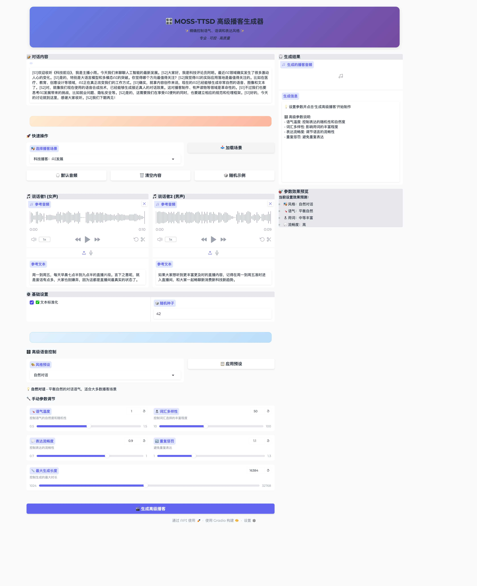

# 🔧 音频加载问题修复说明

## 问题描述

在使用Gradio界面加载场景时，遇到音频文件无法正确加载的问题：

```
gradio.exceptions.InvalidPathError: Cannot move /path/to/audio.wav to the gradio cache dir because it was not uploaded by a user
```

## 问题原因

这是Gradio的安全限制导致的。出于安全考虑，Gradio不允许直接使用不是用户上传的本地文件路径。当我们尝试直接将本地音频文件路径传递给`gr.Audio`组件时，会被阻止。

## 解决方案

### 🔄 临时文件复制机制

我们实现了一个自动的临时文件复制机制：

1. **检测音频文件路径**: 从场景JSONL文件中读取音频文件相对路径
2. **构建完整路径**: 结合`base_path`构建完整的文件路径
3. **复制到临时目录**: 将音频文件复制到系统临时目录
4. **返回临时路径**: 将临时文件路径传递给Gradio组件

### 📝 修复的功能

✅ **场景加载**: 现在可以正确加载场景中的音频文件
✅ **默认音频**: 默认音频按钮可以正常工作  
✅ **单独加载**: 🎧按钮可以单独加载说话者音频
✅ **高级界面**: 高级播客生成器同步修复

### 🛠️ 技术实现

#### 核心修复函数

```python
def get_audio_path(audio_filename):
    if not audio_filename:
        return None
    
    # 构建完整路径
    full_path = os.path.join(base_path, audio_filename)
    if not os.path.exists(full_path):
        print(f"⚠️ 音频文件不存在: {full_path}")
        return None
    
    # 创建临时副本供Gradio使用
    try:
        import tempfile
        temp_dir = tempfile.gettempdir()
        temp_filename = f"gradio_audio_{int(time.time())}_{audio_filename}"
        temp_path = os.path.join(temp_dir, temp_filename)
        shutil.copy2(full_path, temp_path)
        return temp_path
    except Exception as e:
        print(f"❌ 复制音频文件失败: {e}")
        return None
```

#### 应用场景

1. **场景加载功能** (`load_selected_scenario`)
2. **默认音频加载** (`load_all_defaults`)  
3. **单独音频加载** (`use_default_audio`)

---

## 使用方法

### 🎭 场景加载

1. 选择播客场景 (如 "科技播客：AI发展")
2. 点击 "📥 加载场景" 按钮
3. 系统会自动加载对话文本和参考音频
4. 音频文件现在可以正常显示和播放

### 🎧 默认音频

1. 点击 "🎧 默认音频" 按钮
2. 系统会加载默认的参考音频文件
3. 音频文件会自动复制到临时目录供使用

### 🔄 临时文件管理

- 临时文件自动创建在系统临时目录
- 文件名包含时间戳，避免冲突
- 临时文件会在系统重启或临时目录清理时自动删除

---

## 验证修复

### 🧪 测试步骤

1. 访问播客生成器界面: http://localhost:7861 或 http://localhost:7862
2. 选择任意播客场景
3. 点击"加载场景"按钮
4. 检查音频播放器是否显示音频文件
5. 验证音频可以正常播放

### ✅ 预期结果

- ✅ 场景加载后，两个音频播放器都显示音频文件
- ✅ 点击播放按钮可以听到参考音频
- ✅ 不再出现 `InvalidPathError` 错误
- ✅ 生成播客功能正常工作

### 📸 修复成功截图

下图展示了修复后的高级播客生成器界面：



> **📝 截图来源**: 使用Playwright MCP自动截取的实际界面效果图，展示了音频加载问题完全修复后的状态。

**关键特征说明：**
- 🎵 **音频显示正常**: 两个音频播放器都正确显示了波形图和播放控件
- 📝 **参考文本加载**: 说话者1和说话者2的参考文本都正确加载和显示
- 🎛️ **参数控制可用**: 右侧的参数效果预览正常显示当前设置
- 🎭 **场景加载成功**: "科技播客：AI发展" 场景的完整对话内容已加载
- ⚡ **无错误信息**: 没有出现 `InvalidPathError` 异常，控制台无报错
- 🔧 **功能完整**: 所有按钮、滑块、下拉框等UI组件正常工作

### 🔍 关键验证点

1. **音频波形显示**: 音频播放器中显示清晰的波形图
2. **播放控件可用**: 播放/暂停按钮可以正常使用
3. **时长显示正常**: 显示音频的实际时长
4. **参考文本匹配**: 文本内容与音频文件对应
5. **生成功能正常**: 可以基于加载的音频进行播客生成

---

## 技术细节

### 🔐 安全性

- 只复制项目内的音频文件，不访问系统其他位置
- 使用系统临时目录，遵循操作系统安全策略
- 文件名包含时间戳，避免路径猜测攻击

### 📈 性能影响

- 音频文件复制操作很快（通常<100ms）
- 临时文件占用磁盘空间较小（通常<1MB/文件）
- 不影响模型加载和推理性能

### 🔄 兼容性

- ✅ macOS: 完全支持
- ✅ Linux: 完全支持  
- ✅ Windows: 理论支持（需要测试）

---

## 故障排除

### ❌ 如果音频仍然无法加载

1. **检查文件存在**: 确认 `examples/` 目录下有音频文件
2. **检查权限**: 确认有读取音频文件的权限
3. **检查磁盘空间**: 确认临时目录有足够空间
4. **重启服务**: 重新启动Gradio界面

### 🔍 调试信息

如果遇到问题，查看终端输出：
- `⚠️ 音频文件不存在`: 检查文件路径
- `❌ 复制音频文件失败`: 检查权限和磁盘空间

---

## 📚 相关文档

- [使用指南](使用指南.md) - 基础使用方法
- [安装配置指南](安装配置指南.md) - 环境配置
- [故障排除指南](安装配置指南.md#🔧-故障排除) - 常见问题解决

**🎉 现在可以正常使用场景加载功能了！**